PairOfCleats is a **two-plane system** that separates deterministic index building from flexible query execution.

## Core Principles

- **Build plane**: Deterministic artifact production with strict contracts
- **Retrieval plane**: Query planning, candidate generation, scoring, and output shaping
- **Contract-first artifacts**: Manifest-first loading with schema validation
- **Cache identity**: Repo identity → cache root → build root → per-mode index roots

## High-Level Data Flow

```text
Repo files
  → discovery + mode classification
  → chunking + metadata + postings + relations
  → artifact pieces + manifest + build_state
  → optional sqlite/ann materialization
  → builds/current.json promotion

Query
  → parse + plan + intent
  → candidate prefilter
  → sparse rank (BM25 / sqlite-fts)
  → dense rank (ann providers)
  → fusion + boosts + explain
  → stable output (human or json)
```

## System Architecture

PairOfCleats processes repositories through distinct stages, from configuration to query results.

### Runtime + Config Resolution

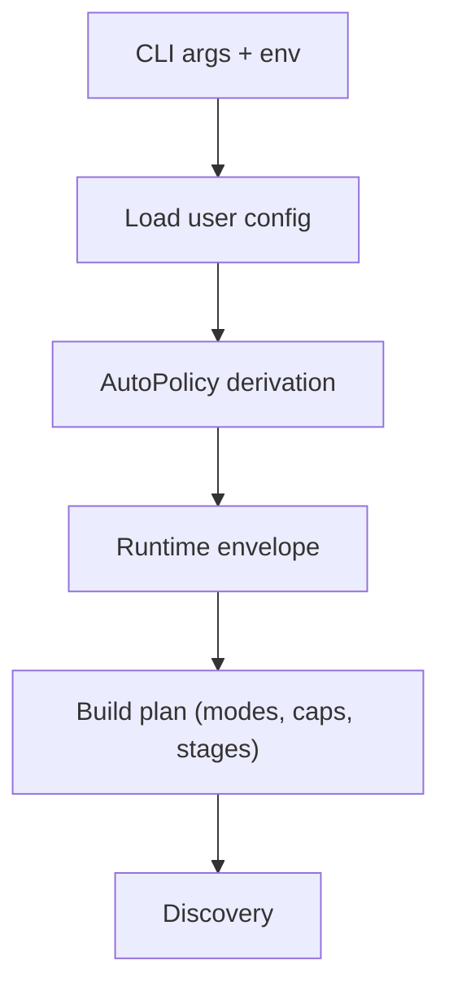

**Key components:**
- User configuration from `.pairofcleats.json`
- Policy normalization and capability resolution
- Concurrency limits and feature detection

**References:**
- `docs/config/contract.md` - Configuration schema and validation
- `docs/config/hard-cut.md` - Hard cutover policy
- `docs/specs/runtime-envelope.md` - Runtime environment specification

### Discovery and Classification

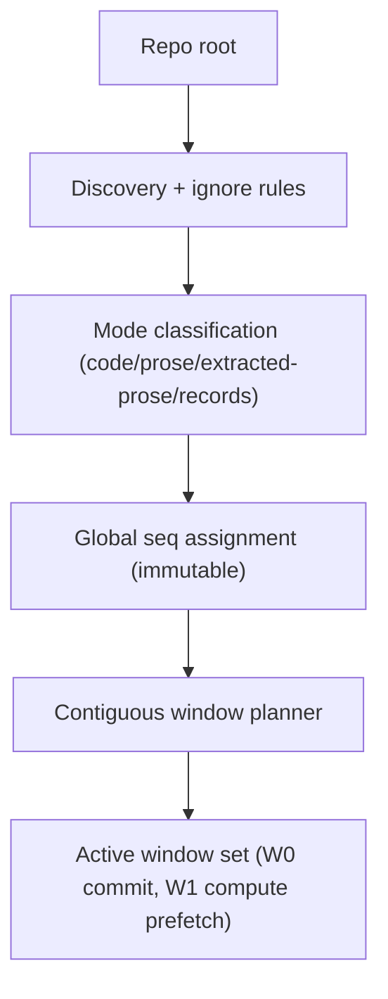

Files are discovered, classified into modes, and assigned deterministic sequence numbers for pipeline processing.

**References:**
- `docs/contracts/indexing.md` - Indexing stages and mode semantics
- `docs/guides/triage-records.md` - Records mode and triage workflow
- `docs/specs/stage1-order-contiguous-runtime.md` - Sequencing invariants
- `docs/specs/stage1-window-planner.md` - Window management

### Foreground Build Pipeline

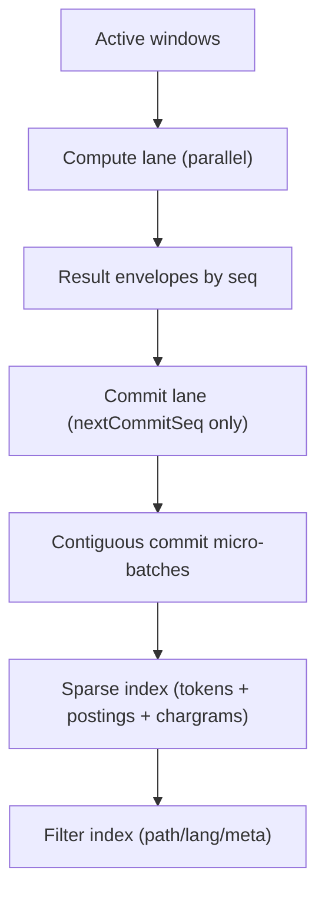

Chunks are extracted in parallel, then committed in sequence to build sparse indexes.

**Key features:**
- Parallel compute with sequential commits
- Deterministic sequence ordering
- Micro-batch writes for efficiency

**References:**
- `docs/contracts/indexing.md` - Artifact requirements
- `docs/language/import-links.md` - Relation extraction
- `docs/guides/search.md` - Search pipeline integration
- `docs/specs/stage1-backpressure-controller.md` - Flow control

### Artifacts and SQLite Build

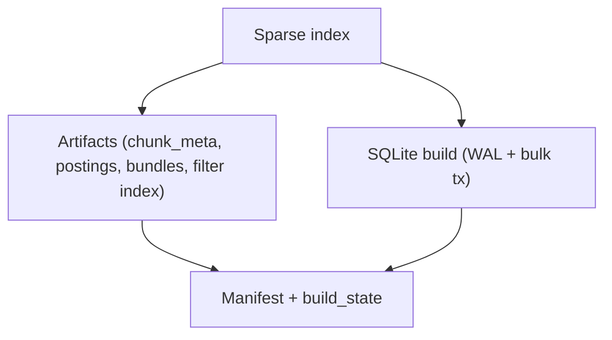

Sparse indexes are materialized as JSON artifacts and optionally written to SQLite databases.

**References:**
- `docs/contracts/public-artifact-surface.md` - Public artifact schema
- `docs/contracts/sqlite.md` - SQLite integration
- `docs/sqlite/index-schema.md` - Database schema

### Background Enrichment

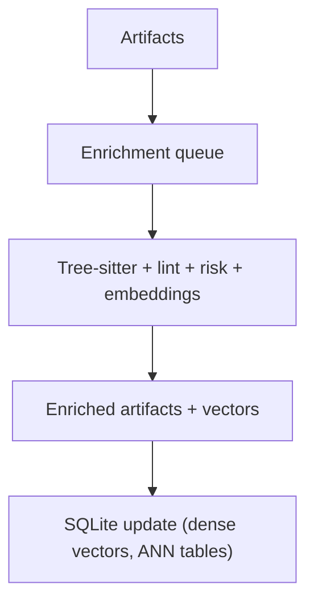

After foreground indexing completes, background stages add semantic metadata and embeddings.

**References:**
- `docs/contracts/indexing.md` - Stage definitions
- `docs/guides/embeddings.md` - Embedding generation
- `docs/sqlite/ann-extension.md` - Vector search integration

### Build Promotion

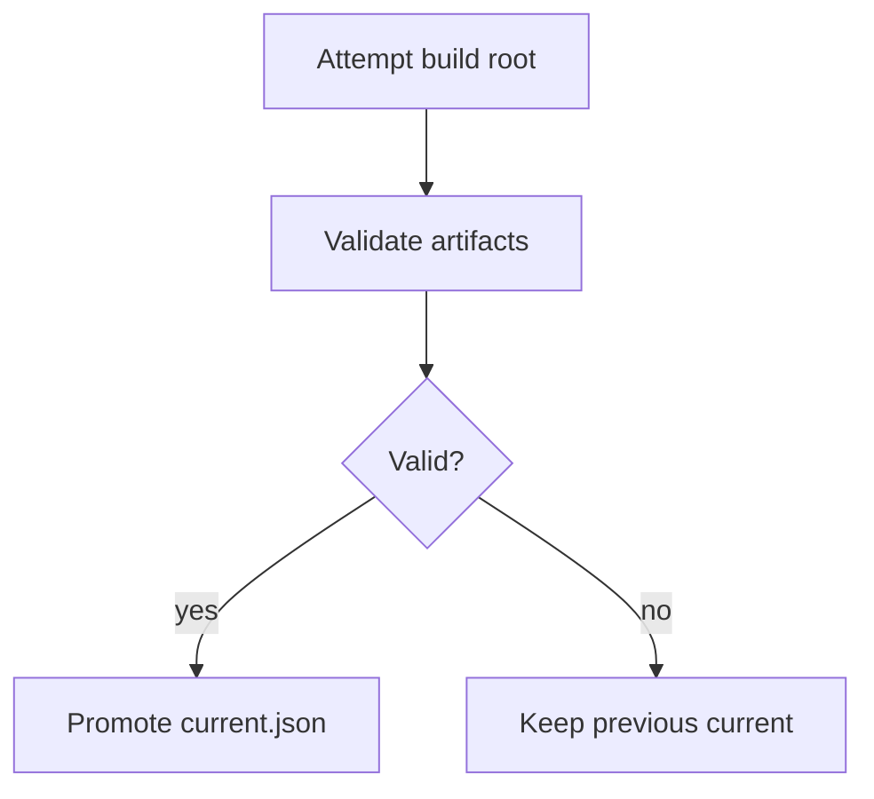

Builds are validated before promotion, ensuring only complete indexes become active.

**References:**
- `docs/specs/watch-atomicity.md` - Atomic updates during watch mode
- `docs/specs/build-state-integrity.md` - Build state validation

## Query Pipeline

The retrieval plane executes queries against promoted indexes.

### Query Parsing and Filters

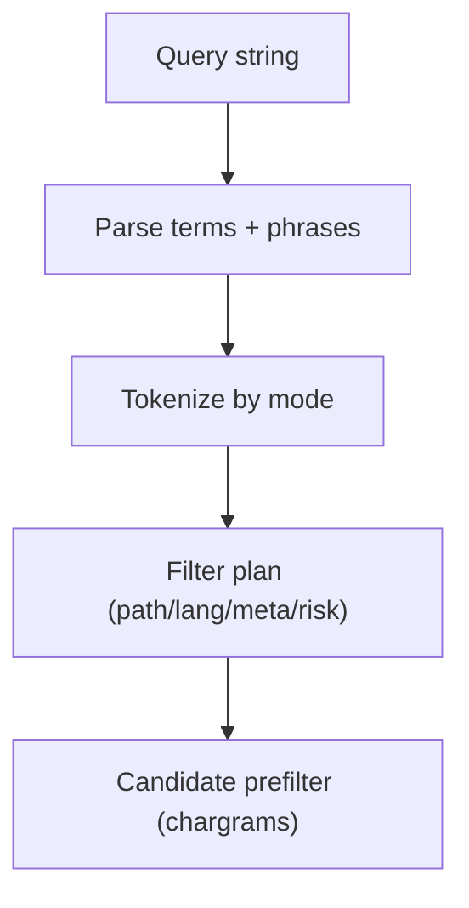

Queries are parsed, tokenized mode-specifically, and filtered using chargram-accelerated prefilters.

**References:**
- `docs/contracts/search-contract.md` - Query schema
- `docs/guides/search.md` - Search behavior

### Ranking and Fusion

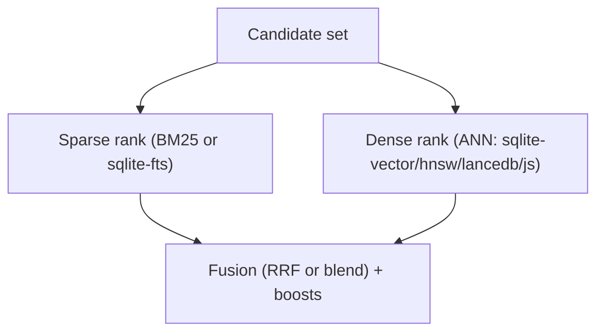

Sparse and dense results are fused using Reciprocal Rank Fusion (RRF) or normalized blending.

**References:**
- `docs/contracts/retrieval-ranking.md` - Ranking algorithms
- `docs/guides/search.md` - Fusion strategies
- `docs/guides/embeddings.md` - Dense vector configuration

### Output and Context

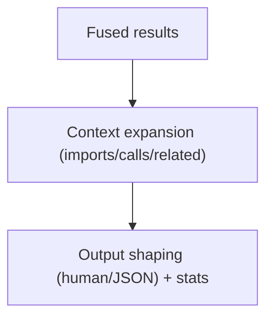

Results are optionally expanded with related code and formatted for human or machine consumption.

**References:**
- `docs/contracts/search-contract.md` - Output schema
- `docs/guides/search.md` - Context expansion configuration

## Cache Layout

PairOfCleats stores all index artifacts outside the repository in a deterministic cache structure.

### Default Layout

```text
<cacheRoot>/repos/<repoId>/
  builds/
    <buildId>/
      build_state.json
      index-code/
      index-prose/
      index-extracted-prose/
      index-records/
      index-sqlite/
      index-lmdb/
    current.json
  snapshots/
    manifest.json
    <snapshotId>/snapshot.json
    <snapshotId>/frozen.json
  diffs/
    manifest.json
    <diffId>/inputs.json
    <diffId>/summary.json
  incremental/
    <mode>/files/
  triage/
    records/
```

**Build ID format:** `YYYYMMDDTHHMMSSZ_<scmHeadShort|noscm>_<configHash8>`

**Repo ID:** Derived from SCM provider head (git commit, jj changeId) and repo path

### Custom Cache Root

Set a custom cache location in `.pairofcleats.json`:

```json
{
  "cache": {
    "root": "C:/absolute/path/to/cache"
  }
}
```

## Backend Selection

PairOfCleats supports multiple storage backends for both sparse and dense retrieval.

### Sparse Backend Choice

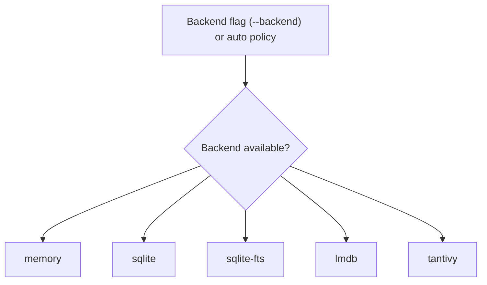

**Backends:**
- **memory**: In-memory postings (fastest for small repos)
- **sqlite**: SQLite BM25 tables
- **sqlite-fts**: SQLite FTS5 full-text search
- **lmdb**: LMDB key-value store
- **tantivy**: Rust-based full-text search (planned)

### ANN Backend Choice

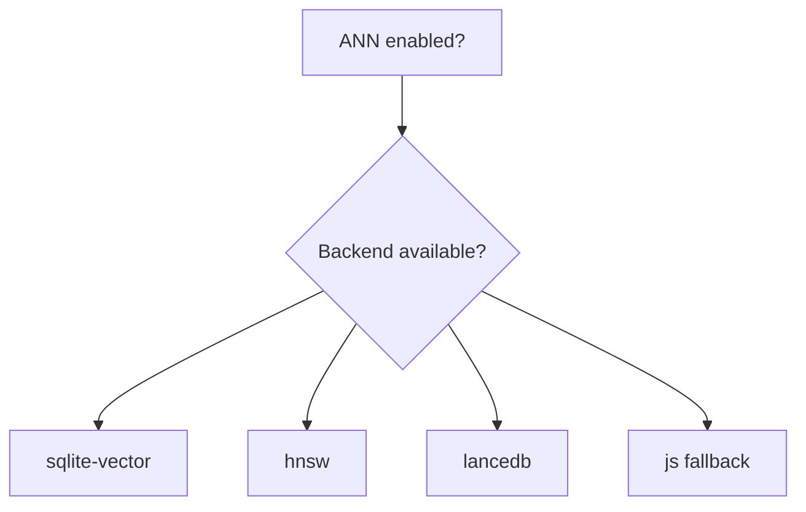

**ANN providers:**
- **sqlite-vector**: sqlite-vec extension (merged vectors only)
- **hnsw**: In-memory HNSW index
- **lancedb**: LanceDB vector database
- **js**: Pure JavaScript brute-force (fallback)

**References:**
- `docs/contracts/search-cli.md` - Backend flags
- `docs/contracts/sqlite.md` - SQLite integration
- `docs/sqlite/ann-extension.md` - Vector extension
- `docs/guides/external-backends.md` - Backend capabilities

<Info>
PairOfCleats automatically selects the best available backend based on capabilities and configuration. Use `--explain` to see which backends were chosen for a query.
</Info>
