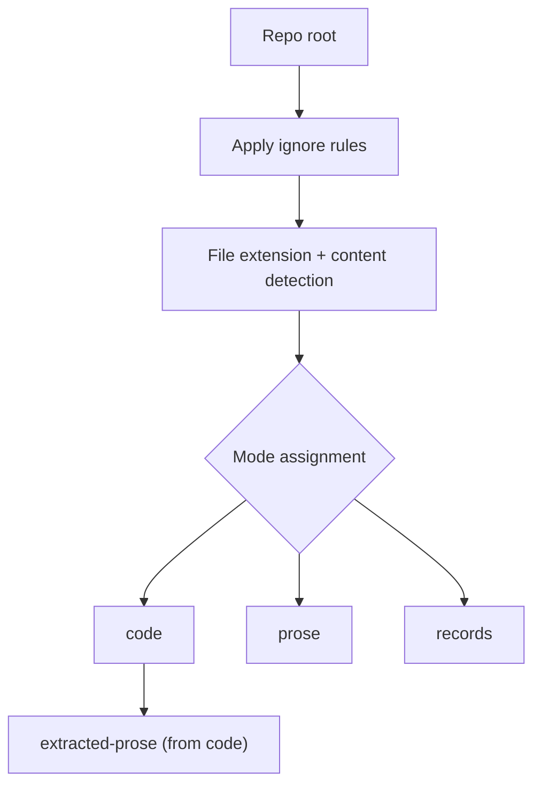
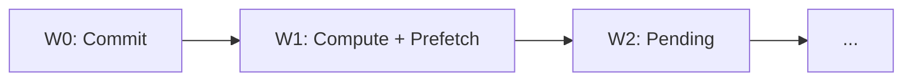

The indexing pipeline transforms repository files into searchable artifacts through multiple stages.

## Stages and Modes

PairOfCleats builds indexes in distinct stages, each adding capability to the search experience.

### Stage Definitions

- **Stage1 (sparse)**: Discovery, chunking, and token postings for each mode
- **Stage2 (enrich)**: File metadata, repo maps, relations, and filter indexes
- **Stage3 (embeddings)**: Dense vectors, HNSW indexes, LanceDB artifacts, and embeddings cache
- **Stage4 (sqlite)**: SQLite index build plus optional ANN tables

### Modes

- **`code`**: Indexes code bodies and structural metadata; comments are not indexed as searchable text
- **`prose`**: Indexes documentation and prose files (Markdown, text, etc.); comments inside prose files remain part of prose
- **`extracted-prose`**: Indexes only extracted segments (comments, docstrings, config comments); never falls back to full file body
- **`records`**: Indexes log/record artifacts; excludes those files from other modes
- **`all`**: Builds all enabled modes: `{code, prose, extracted-prose, records}`

<Note>
The `code` mode excludes comment text from searchable tokens but extracts them as `extracted-prose` spans. Use `--mode all` to search both code structure and comment content.
</Note>

## Discovery and Classification

Before indexing begins, PairOfCleats discovers files and assigns them to modes.



**Discovery rules:**
1. Apply `.gitignore`, `.pairofcleatsignore`, and configured ignore patterns
2. Detect file type by extension and content sniffing
3. Assign mode based on file type:
   - Code files → `code` mode
   - Markdown, text → `prose` mode
   - Logs, JSON records → `records` mode
4. Extract comments/docstrings from code → `extracted-prose` mode

**Sequence assignment:**
- Each discovered file receives a global, immutable sequence number
- Sequences enable deterministic ordering and windowed processing
- Files are processed in sequence order during foreground indexing

**References:**
- `docs/contracts/indexing.md` - Mode semantics
- `docs/guides/triage-records.md` - Records mode details
- `docs/specs/stage1-order-contiguous-runtime.md` - Sequencing invariants

## Foreground Indexing (Stage 1)

The foreground pipeline produces sparse indexes with token postings and metadata.

### Window Planner

Files are processed in contiguous windows to balance parallelism and memory:



- **W0 (Commit window)**: Results ready for commit; written to index sequentially
- **W1 (Compute window)**: Active parallel processing; embeddings prefetched
- **W2+ (Pending)**: Queued for future windows

**References:**
- `docs/specs/stage1-window-planner.md` - Window management
- `docs/specs/stage1-backpressure-controller.md` - Flow control

### Compute Lane (Parallel)

Within the compute window, files are processed in parallel:

1. **Read file content** (with encoding detection)
2. **Chunking**:
   - Code: AST-aware chunking by function/class/module
   - Prose: Semantic paragraph/section chunking
   - Records: Line-by-line or record-boundary chunking
3. **Metadata extraction**:
   - File path, extension, size, hash
   - Chunk kind, name, start/end lines
   - Optional tree-sitter metadata (Stage 2)
4. **Tokenization** (mode-specific):
   - Code: Preserve punctuation (`::`, `&&`, `=>`)
   - Prose: Stop-word removal and stemming
5. **Posting list updates**: Token → chunk ID mappings

**Output:** Result envelopes with chunk metadata, tokens, and postings

### Commit Lane (Sequential)

Envelopes from W0 are committed sequentially:

1. **Sequence validation**: Ensure `nextCommitSeq` is honored
2. **Micro-batch writes**: Group envelopes for efficient I/O
3. **Sparse index updates**:
   - Append to `chunk_meta.jsonl` or sharded parts
   - Update `token_postings.json` vocabulary and postings
   - Extend `filter_index.json` for path/metadata filters
4. **Advance `nextCommitSeq`** for next batch

**Invariants:**
- Commits are contiguous (no gaps in sequence numbers)
- Chunk IDs are sequential and zero-based
- File IDs are unique and referenced by chunks

**References:**
- `docs/contracts/indexing.md` - Artifact schema
- `docs/specs/stage1-order-contiguous-runtime.md` - Commit ordering

## Enrichment (Stage 2)

After foreground indexing, Stage 2 adds structural metadata and relations.

### File Metadata

Expands `file_meta.json` with:
- Language detection
- File type classification
- Import/export analysis
- Symbol definitions

### Repo Map

Flattens symbol hierarchy into `repo_map.json`:
```json
[
  {
    "file": "src/indexing/chunker.js",
    "symbols": [
      {"kind": "function", "name": "chunkCode", "line": 42}
    ]
  }
]
```

### Relations

Extracts import/export/call relations into `file_relations.json` and optionally `call_sites.jsonl`:

```json
{
  "fileId": 123,
  "imports": [
    {"from": "./chunker", "symbols": ["chunkCode"]}
  ],
  "exports": [
    {"name": "buildIndex", "kind": "function"}
  ]
}
```

**References:**
- `docs/language/import-links.md` - Relation extraction
- `docs/contracts/artifact-contract.md` - Artifact schemas

### Filter Index

Builds `filter_index.json` with chargram-indexed paths and metadata:

```json
{
  "fileChunksById": {
    "0": [0, 1, 2],
    "1": [3, 4]
  },
  "pathChargrams": {
    "src": [0, 1],
    "ind": [0, 2]
  },
  "metadata": {
    "lang:javascript": [0, 1, 2],
    "ext:.js": [0, 1, 2, 3]
  }
}
```

Chargrams enable fast substring and regex prefiltering for `--file` and `--path` filters.

**References:**
- `docs/guides/search.md` - Filter prefilter behavior

## Embeddings (Stage 3)

Stage 3 generates dense vectors for semantic search.

### Embedding Generation

1. **Model selection**: Choose embedding model (default: `nomic-embed-text-v1.5`)
2. **Chunk preparation**: Format chunks with metadata context
3. **Batch encoding**: Generate embeddings in batches
4. **Quantization**: Optionally quantize to uint8 for efficiency
5. **Cache storage**: Store in out-of-band embeddings cache (safe to delete)

**Output artifacts:**
- `dense_vectors_uint8.json`: Quantized merged vectors
- `dense_vectors_doc_uint8.json`: Doc-specific vectors
- `dense_vectors_code_uint8.json`: Code-specific vectors

### ANN Indexing

After embedding generation, ANN indexes are built:

- **HNSW**: In-memory hierarchical navigable small world graph
- **LanceDB**: Persistent vector database with columnar storage
- **sqlite-vec**: SQLite extension for merged vectors only

**References:**
- `docs/guides/embeddings.md` - Embedding configuration
- `docs/sqlite/ann-extension.md` - sqlite-vec integration
- `docs/specs/embeddings-cache.md` - Cache behavior

<Info>
Embeddings are stored in an out-of-band cache (not part of build artifacts) and can be safely deleted. They will be regenerated on the next build.
</Info>

## SQLite Materialization (Stage 4)

Optionally, artifacts are materialized into SQLite databases for faster query execution.

### SQLite Build Process

1. **Schema creation**: Create tables for chunks, postings, and metadata
2. **Bulk insert**: Load artifacts in WAL mode with large transactions
3. **Index creation**: Build SQLite indexes for fast lookups
4. **ANN tables**: Create vector tables if sqlite-vec is available
5. **Atomic swap**: Move temporary `.db` to final location

**Output:**
- `index-sqlite/index-code.db`
- `index-sqlite/index-prose.db`

**References:**
- `docs/sqlite/index-schema.md` - SQLite schema
- `docs/contracts/sqlite.md` - SQLite integration

## Index Profiles

Index profiles control which artifacts are built and required for search.

### Profile Types

- **`default`**: Full sparse + dense artifacts
- **`vector_only`**: Dense vectors only; sparse artifacts omitted

### Profile Contract

Profiles are recorded in `index_state.json`:

```json
{
  "profile": {
    "id": "default",
    "schemaVersion": 1
  },
  "artifacts": {
    "schemaVersion": 1,
    "present": ["chunk_meta", "token_postings", "dense_vectors_uint8"],
    "omitted": [],
    "requiredForSearch": ["chunk_meta", "token_postings"]
  }
}
```

**References:**
- `docs/contracts/indexing.md` - Profile schema
- `docs/specs/vector-only-profile.md` - Vector-only examples

## Build State and Provenance

Each build writes `build_state.json` at the build root:

```json
{
  "schemaVersion": "1.0.0",
  "signatureVersion": 1,
  "repo": {
    "provider": "git",
    "head": {
      "commitHash": "abc123...",
      "commitShort": "abc123"
    }
  },
  "buildId": "20260301T120000Z_abc123_9f8e7d6c",
  "stages": {
    "stage1": {"completed": true},
    "stage2": {"completed": true},
    "stage3": {"completed": false}
  }
}
```

**Key fields:**
- `repo.provider`: SCM provider (`git`, `jj`, `none`)
- `repo.head`: Provider-specific head metadata
- `buildId`: Deterministic build identifier
- `stages`: Per-stage completion status

**No-SCM builds:**
When `provider=none`, provenance fields are `null` and buildId uses `noscm` marker:
- Build ID format: `20260301T120000Z_noscm_9f8e7d6c`
- File discovery falls back to filesystem crawl
- SCM-based metadata (annotate/churn) is disabled

**References:**
- `src/contracts/schemas/build-state.js` - Schema definition
- `src/contracts/validators/build-state.js` - Validation logic
- `docs/specs/scm-provider-contract.md` - SCM provider interface

## Artifact Formats

Artifacts support multiple formats for flexibility and performance.

### Format Precedence

**chunk_meta** (non-strict mode):
1. `chunk_meta.meta.json` + `chunk_meta.parts/` (sharded JSONL, if newer mtime)
2. `chunk_meta.jsonl` (single JSONL file)
3. `chunk_meta.columnar.json` (columnar format)
4. `chunk_meta.json` (legacy array format)

**token_postings** (non-strict mode):
1. `token_postings.meta.json` + `token_postings.shards/` (sharded)
2. `token_postings.json` (single file)

**Compression:**
- Raw `.json`/`.jsonl` files are read first
- `.json.gz` and `.json.zst` sidecars used only if raw file missing
- Compression is transparent (no `compression` field in JSON payload)

### Sharded Meta Schema

Sharded JSONL artifacts use `*.meta.json`:

```json
{
  "schemaVersion": "0.0.1",
  "artifact": "chunk_meta",
  "format": "jsonl-sharded",
  "generatedAt": "2026-03-01T12:00:00Z",
  "compression": "none",
  "totalRecords": 250000,
  "totalBytes": 987654321,
  "maxPartRecords": 100000,
  "maxPartBytes": 104857600,
  "targetMaxBytes": 104857600,
  "parts": [
    {"path": "chunk_meta.parts/chunk_meta.part-00000.jsonl", "records": 100000, "bytes": 40000000},
    {"path": "chunk_meta.parts/chunk_meta.part-00001.jsonl", "records": 100000, "bytes": 40000000}
  ]
}
```

**References:**
- `docs/contracts/indexing.md` - Format precedence rules
- `docs/contracts/artifact-contract.md` - Artifact schemas

## Invariants

The indexing pipeline maintains strict invariants:

1. **Sequential chunk IDs**: Chunk IDs are zero-based and sequential
2. **Unique file IDs**: File IDs are unique and referenced by `chunk_meta.fileId`
3. **Contiguous commits**: No gaps in sequence numbers during commit
4. **Atomic writes**: Artifacts use temp files + `.bak` fallback; sharded artifacts staged and swapped
5. **ConfigHash integrity**: Artifact `configHash` excludes secrets (API tokens); only content-relevant config
6. **Stage gating**: Readers check `index_state.json` for stage completion before loading artifacts

**References:**
- `docs/contracts/indexing.md` - Invariants and validation
- `pairofcleats index validate` - Validation command

<Note>
Use `pairofcleats index validate` to check artifact consistency. Failures indicate rebuild is required.
</Note>
