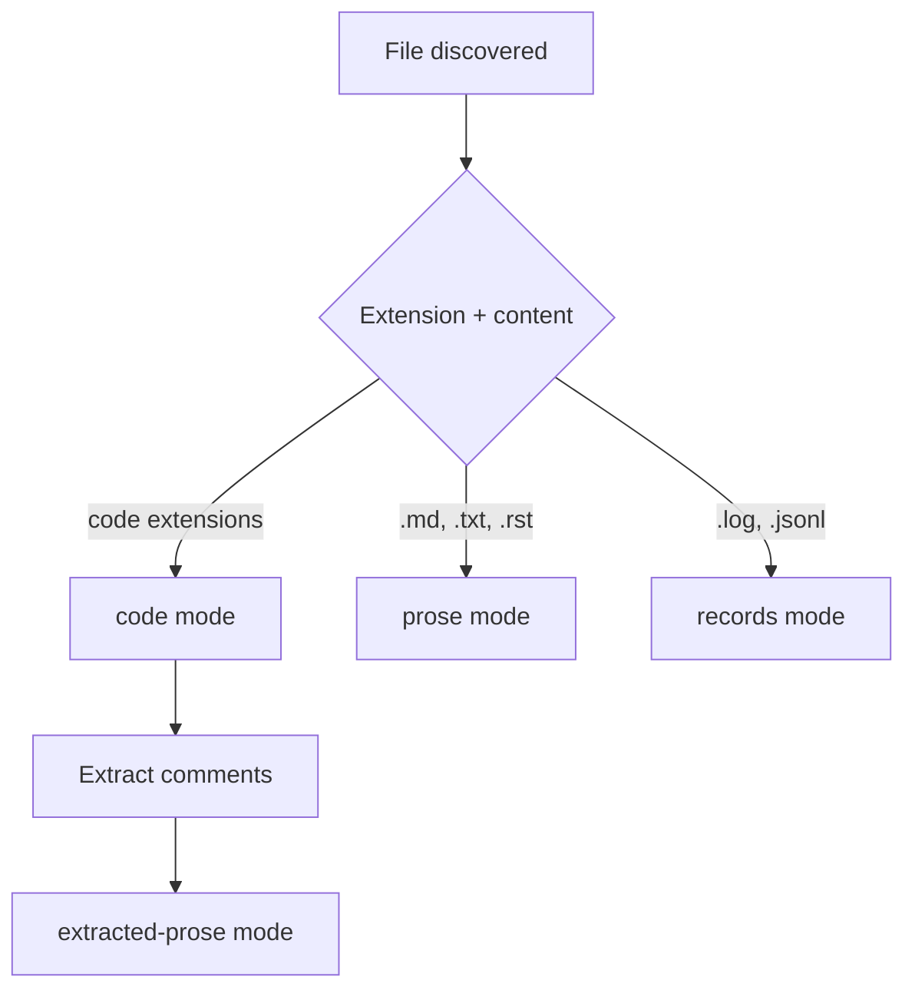

PairOfCleats indexes repositories in distinct **modes**, each optimized for different content types.

## Mode Definitions

PairOfCleats supports four indexing modes:

- **`code`**: Indexes code bodies and structural metadata
- **`prose`**: Indexes documentation and prose files (Markdown, text, etc.)
- **`extracted-prose`**: Indexes extracted segments (comments, docstrings, config comments)
- **`records`**: Indexes log/record artifacts
- **`all`**: Builds all enabled modes: `{code, prose, extracted-prose, records}`

<Info>
Each mode produces a separate index under `index-<mode>/` with its own artifacts and search behavior.
</Info>

## Mode Semantics

Each mode has specific behavior for what content is indexed and how.

### Code Mode

**Indexes:**
- Code bodies (functions, classes, modules)
- Structural metadata (imports, exports, definitions)
- Symbol names and signatures

**Excludes:**
- Comment text (comments are extracted as `extracted-prose` spans)
- Full file bodies of non-code files

**Chunking:**
- AST-aware chunking by function/class/module boundaries
- Tree-sitter parsing for language-specific structure

**Tokenization:**
- Preserves punctuation tokens: `::`, `&&`, `=>`, `->`, etc.
- No stop-word removal (code keywords are meaningful)
- No stemming (exact token matching)

**Example files:**
```text
src/indexing/chunker.js
src/search/bm25.js
tools/setup/install.js
```

**Search behavior:**
```bash
pairofcleats search "BM25 scoring algorithm" --mode code
```

Matches function names, class names, and code structure. Comment text is **not** searchable in code mode.

<Note>
To search both code structure and comment content, use `--mode all` to include `extracted-prose`.
</Note>

**References:**
- `docs/language/import-links.md` - Relation extraction
- `docs/specs/unified-syntax-representation.md` - AST representation

### Prose Mode

**Indexes:**
- Documentation files (Markdown, text, reStructuredText)
- README files
- Prose content in config files (e.g., YAML comments)

**Includes:**
- Comments inside prose files remain part of prose (not extracted separately)

**Chunking:**
- Semantic paragraph/section chunking
- Preserves heading hierarchy
- Respects Markdown structure (code blocks, lists, tables)

**Tokenization:**
- Stop-word removal (common words like "the", "is", "a")
- Stemming ("running" → "run")
- Phrase detection

**Example files:**
```text
README.md
docs/guides/architecture.md
docs/contracts/indexing.md
```

**Search behavior:**
```bash
pairofcleats search "how to configure embeddings" --mode prose
```

Matches documentation and guides. Uses stemming and stop-word removal for natural language queries.

**References:**
- `docs/contracts/indexing.md` - Mode semantics

### Extracted-Prose Mode

**Indexes:**
- Comments and docstrings extracted from code files
- Config file comments (YAML, TOML, JSON5)
- Inline documentation

**Never indexes:**
- Full file bodies (extraction-only mode)

**Chunking:**
- Comment blocks grouped by proximity
- Docstrings associated with their symbols

**Tokenization:**
- Similar to prose mode (stop-word removal, stemming)
- Preserves code references inside comments (backticks, camelCase)

**Example content:**
```javascript
/**
 * Chunks code into searchable segments using AST-aware boundaries.
 * @param {string} content - The code content to chunk
 * @param {string} mode - The indexing mode
 */
function chunkCode(content, mode) {
  // Implementation details...
}
```

The docstring and inline comment are indexed in `extracted-prose` mode, but the function body is indexed in `code` mode.

**Search behavior:**
```bash
pairofcleats search "AST-aware chunking" --mode extracted-prose
```

Matches comments and docstrings. Useful for finding code explanations and design rationale.

<Info>
Extracted-prose mode enables searching for "why" (comments/docs) separately from "what" (code structure).
</Info>

**References:**
- `docs/contracts/indexing.md` - Extraction semantics

### Records Mode

**Indexes:**
- Log files
- Vulnerability findings (Dependabot, AWS Inspector, etc.)
- Triage records and decisions
- Structured record artifacts (JSON, JSONL)

**Excludes:**
- Files indexed as records are excluded from `code`, `prose`, and `extracted-prose` modes

**Chunking:**
- Line-by-line or record-boundary chunking
- Preserves record structure (JSON objects, log entries)

**Tokenization:**
- Similar to prose mode
- Preserves metadata fields for filtering

**Example files:**
```text
<cache>/repos/<repoId>/triage/records/CVE-2024-0001.json
<cache>/repos/<repoId>/triage/records/CVE-2024-0001.md
logs/application.log
```

**Search behavior:**
```bash
pairofcleats search "CVE-2024-0001" --mode records --meta service=api --meta env=prod
```

Matches records with metadata filters. Ideal for vulnerability triage and log analysis.

**References:**
- `docs/guides/triage-records.md` - Records workflow
- `docs/contracts/indexing.md` - Records mode semantics

## Mode Classification

During discovery, files are assigned to modes based on extension and content.

### Classification Rules



**Code extensions:**
- JavaScript/TypeScript: `.js`, `.ts`, `.jsx`, `.tsx`
- Python: `.py`
- Rust: `.rs`
- Go: `.go`
- Java: `.java`
- C/C++: `.c`, `.cpp`, `.h`, `.hpp`
- ... (full list in `src/config/file-types.js`)

**Prose extensions:**
- Markdown: `.md`, `.markdown`
- Text: `.txt`
- reStructuredText: `.rst`
- AsciiDoc: `.adoc`

**Records extensions:**
- Logs: `.log`
- JSONL: `.jsonl` (when in triage/records directories)

**Extracted-prose sources:**
- JavaScript: `//` and `/* */` comments, JSDoc
- Python: `#` comments, `"""` docstrings
- Rust: `//` and `///` comments
- Go: `//` comments
- ... (language-specific comment extraction)

**Configuration:**
File type assignments can be customized in `.pairofcleats.json`:

```json
{
  "indexing": {
    "fileTypes": {
      "code": [".js", ".ts", ".py"],
      "prose": [".md", ".txt"],
      "records": [".log", ".jsonl"]
    }
  }
}
```

## Mode-Specific Search Behavior

### Tokenization Differences

| Mode | Punctuation | Stop-words | Stemming |
|------|-------------|------------|----------|
| **code** | Preserved (`::`, `&&`) | No | No |
| **prose** | Removed | Yes | Yes |
| **extracted-prose** | Mixed (code refs preserved) | Yes | Yes |
| **records** | Removed | Yes | Yes |

**Code query example:**
```bash
pairofcleats search "&&" --mode code
```
Matches code using `&&` operator (punctuation preserved).

**Prose query example:**
```bash
pairofcleats search "running tests" --mode prose
```
Matches "run test", "runs tests", "running test" (stemming applied).

### Field Weights

Mode-specific field weights prioritize different chunk fields:

**Code mode weights:**
```json
{
  "name": 3.0,
  "signature": 2.0,
  "doc": 1.5,
  "body": 1.0
}
```

Symbol names and signatures ranked higher than body text.

**Prose mode weights:**
```json
{
  "name": 2.0,
  "headline": 2.0,
  "doc": 1.5,
  "body": 1.0
}
```

Headings and document structure ranked higher.

**Configuration:**
```json
{
  "search": {
    "fieldWeights": {
      "name": 3.0,
      "signature": 2.0,
      "doc": 1.5,
      "body": 1.0
    }
  }
}
```

**References:**
- `docs/guides/search.md` - Field weights configuration

### Vector Selection

Dense vector mode can be chosen based on query intent:

- **Code queries**: Use `code` vectors optimized for syntax and structure
- **Prose queries**: Use `doc` vectors optimized for natural language
- **Auto mode**: Automatically select based on query heuristics

**Query intent heuristics:**
- **code**: Contains symbols, camelCase, snake_case, operators (`&&`, `=>`)
- **prose**: Natural language sentences, common words
- **path**: File path patterns (`src/`, `*.js`)
- **mixed**: Combination of above

**Configuration:**
```json
{
  "search": {
    "denseVectorMode": "auto"
  }
}
```

Or via CLI:
```bash
pairofcleats search "BM25 algorithm" --mode code --dense-vector-mode code
```

**References:**
- `docs/guides/search.md` - Dense vector mode
- `docs/guides/embeddings.md` - Embedding generation

## Building Modes

Modes can be built individually or together.

### Build Individual Mode

```bash
pairofcleats index build --mode code
pairofcleats index build --mode prose
pairofcleats index build --mode extracted-prose
pairofcleats index build --mode records
```

### Build All Modes

```bash
pairofcleats index build --mode all
```

Builds `{code, prose, extracted-prose, records}` in parallel.

### Incremental Builds

```bash
pairofcleats index build --mode code --incremental
```

Reuses cached chunks for unchanged files.

### Watch Mode

```bash
pairofcleats index watch --mode all
```

Rebuild on file changes.

**References:**
- `docs/guides/commands.md` - CLI reference
- `docs/specs/watch-atomicity.md` - Watch behavior

## Searching Modes

### Search Single Mode

```bash
pairofcleats search "query" --mode code
pairofcleats search "query" --mode prose
pairofcleats search "query" --mode extracted-prose
pairofcleats search "query" --mode records
```

### Search All Modes

```bash
pairofcleats search "query" --mode all
```

Returns results from all modes in separate sections.

### Filter by Mode

```bash
pairofcleats search "BM25" --mode code --file "*.js"
pairofcleats search "setup instructions" --mode prose --ext .md
```

**References:**
- `docs/contracts/search-cli.md` - CLI flags
- `docs/guides/search.md` - Search behavior

## Triage Records Workflow

Records mode supports specialized vulnerability triage workflows.

### Ingest Findings

**Dependabot:**
```bash
node tools/triage/ingest.js --source dependabot --in dependabot.json --meta service=api --meta env=prod
```

**AWS Inspector:**
```bash
node tools/triage/ingest.js --source aws_inspector --in inspector.json --meta service=api --meta env=prod
```

**Generic:**
```bash
node tools/triage/ingest.js --source generic --in record.json --meta service=api --meta env=prod
```

### Write Decisions

```bash
node tools/triage/decision.js --finding CVE-2024-0001 --status accept --justification "Mitigated by WAF" --reviewer "alice"
```

### Build Records Index

```bash
pairofcleats index build --mode records --incremental
```

### Search Records

```bash
pairofcleats search "CVE-2024-0001" --mode records --meta service=api --meta env=prod --json
```

### Generate Context Packs

```bash
node tools/triage/context-pack.js --record CVE-2024-0001 --out context.json
```

Context packs include:
- Normalized finding
- Related decisions
- Code/prose evidence from repo

**References:**
- `docs/guides/triage-records.md` - Full triage workflow

## Mode Configuration

Mode behavior can be customized in `.pairofcleats.json`.

### Indexing Configuration

```json
{
  "indexing": {
    "modes": {
      "code": {
        "enabled": true,
        "chunking": "ast-aware",
        "extractComments": true
      },
      "prose": {
        "enabled": true,
        "chunking": "semantic",
        "maxChunkSize": 1024
      },
      "extractedProse": {
        "enabled": true,
        "fallbackToFullFile": false
      },
      "records": {
        "enabled": true,
        "recordsDir": "<repoCacheRoot>/triage/records"
      }
    }
  }
}
```

### Search Configuration

```json
{
  "search": {
    "modes": {
      "code": {
        "fieldWeights": {
          "name": 3.0,
          "signature": 2.0,
          "doc": 1.5,
          "body": 1.0
        }
      },
      "prose": {
        "fieldWeights": {
          "headline": 2.0,
          "doc": 1.5,
          "body": 1.0
        }
      }
    },
    "denseVectorMode": "auto"
  }
}
```

**References:**
- `docs/config/schema.json` - Full configuration schema
- `docs/config/contract.md` - Configuration validation

## Index State Per Mode

Each mode maintains its own `index_state.json` with stage completion and artifact presence.

**Example (index-code/index_state.json):**
```json
{
  "schemaVersion": "1.0.0",
  "mode": "code",
  "stages": {
    "stage1": {"completed": true},
    "stage2": {"completed": true},
    "stage3": {"completed": false}
  },
  "profile": {
    "id": "default",
    "schemaVersion": 1
  },
  "artifacts": {
    "schemaVersion": 1,
    "present": ["chunk_meta", "token_postings", "file_meta"],
    "omitted": [],
    "requiredForSearch": ["chunk_meta", "token_postings"]
  }
}
```

Search gates on `index_state.json` to ensure required artifacts are present before loading.

**References:**
- `docs/contracts/indexing.md` - Index state schema
- `docs/contracts/artifact-contract.md` - Artifact requirements

<Info>
Each mode is independently gated. Incomplete stages in one mode do not block searches in other modes.
</Info>
