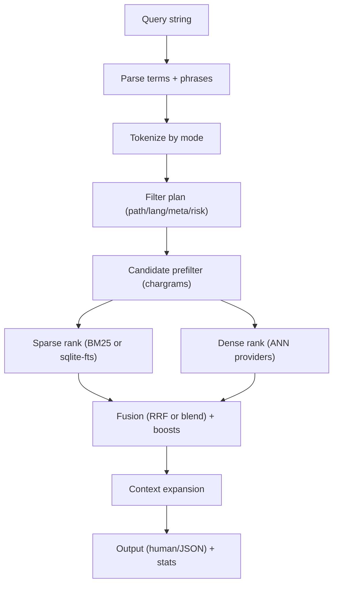

PairOfCleats supports multiple retrieval strategies: sparse keyword search, dense vector search, and hybrid fusion.

## Search Pipeline Overview



## Sparse Retrieval (BM25)

**BM25** is the primary sparse ranker in PairOfCleats, scoring chunks based on token frequency and document length.

### BM25 Algorithm

BM25 scores each chunk based on:
- **Term frequency (TF)**: How often query terms appear in the chunk
- **Inverse document frequency (IDF)**: Rarity of terms across all chunks
- **Document length normalization**: Penalizes very long chunks

**Parameters:**
- `k1` (default: 1.2): Controls term frequency saturation
- `b` (default: 0.75): Controls length normalization strength

### Fielded BM25

When field postings are available, BM25 scores across multiple fields:

- **`name`**: Symbol/chunk name (highest weight)
- **`signature`**: Function signature or type annotation
- **`doc`**: Documentation/docstring
- **`body`**: Main chunk content

**Field weights** (configurable via `search.fieldWeights`):
```json
{
  "name": 3.0,
  "signature": 2.0,
  "doc": 1.5,
  "body": 1.0
}
```

<Info>
Fielded BM25 improves ranking by boosting matches in symbol names and signatures over body text.
</Info>

### SQLite FTS5

When SQLite backend is enabled, FTS5 provides an alternate sparse ranker:

- Uses SQLite's built-in full-text search
- Supports phrase queries and column weights
- Typically faster for large indexes

**FTS5 weights** (configurable via `search.sqliteFtsWeights`):
```json
{
  "file": 0.5,
  "name": 3.0,
  "signature": 2.0,
  "kind": 1.0,
  "headline": 1.5,
  "doc": 1.5,
  "tokens": 1.0
}
```

**References:**
- `docs/guides/search.md` - Sparse configuration
- `docs/contracts/retrieval-ranking.md` - BM25 specification

## Dense Retrieval (Vector Search)

Dense retrieval uses semantic embeddings to find chunks based on meaning rather than exact keywords.

### Vector Types

PairOfCleats generates three vector types:

- **Merged vectors**: Combined code + doc embeddings (used by sqlite-vec)
- **Code vectors**: Optimized for code structure and syntax
- **Doc vectors**: Optimized for natural language documentation

### Dense Vector Mode

Control which vectors are used via `search.denseVectorMode` or `--dense-vector-mode`:

- **`merged`**: Use merged vectors (default for sqlite-vec)
- **`code`**: Use code-specific vectors
- **`doc`**: Use doc-specific vectors
- **`auto`**: Automatically select based on query intent

**Query intent classification:**
- **`code`**: Contains symbols, camelCase, snake_case, operators
- **`prose`**: Natural language sentences
- **`path`**: File path patterns
- **`mixed`**: Combination of above

**Precedence:** CLI flag > user config > defaults

<Note>
sqlite-vec currently supports merged vectors only. When `denseVectorMode=code|doc|auto`, sqlite-vec ANN is disabled and other backends are used.
</Note>

### ANN Providers

PairOfCleats supports multiple ANN (Approximate Nearest Neighbor) backends:

#### sqlite-vector
- SQLite extension for vector search
- Fast for small to medium indexes
- Merged vectors only
- Automatically used when available

#### HNSW
- In-memory hierarchical navigable small world graph
- Excellent recall and speed
- Supports code/doc/merged vectors
- Best for medium to large indexes

#### LanceDB
- Persistent columnar vector database
- Efficient disk usage and fast queries
- Supports code/doc/merged vectors
- Best for very large indexes

#### JavaScript Fallback
- Pure JS brute-force search
- Always available
- Slow for large indexes
- Used when no other provider available

**Backend selection:**
PairOfCleats automatically selects the best available backend based on:
1. Capability (is the backend installed?)
2. Policy (user configuration preferences)
3. Vector mode (does backend support the chosen vector type?)

**References:**
- `docs/guides/embeddings.md` - Embedding generation
- `docs/sqlite/ann-extension.md` - sqlite-vec integration
- `docs/guides/external-backends.md` - Backend capabilities

## Hybrid Fusion

When both sparse and dense results are available, PairOfCleats fuses them using **Reciprocal Rank Fusion (RRF)**.

### Reciprocal Rank Fusion (RRF)

RRF combines ranked lists by summing reciprocal ranks:

```
RRF_score(chunk) = Σ 1 / (k + rank_i(chunk))
```

Where:
- `rank_i(chunk)` is the rank of the chunk in list `i` (1-based)
- `k` is a constant (default: 60) to reduce variance

**Benefits:**
- Scale-independent (no score normalization needed)
- Robust to outliers
- Favors chunks that appear in multiple lists

**Configuration:**
```json
{
  "search": {
    "rrf": {
      "enabled": true,
      "k": 60
    }
  }
}
```

### Score Blending (Alternate)

When `search.scoreBlend.enabled=true`, normalized blending is used instead of RRF:

```
blend_score = w_sparse * normalize(sparse_score) + w_dense * normalize(dense_score)
```

**Configuration:**
```json
{
  "search": {
    "scoreBlend": {
      "enabled": true,
      "sparseWeight": 0.6,
      "denseWeight": 0.4
    }
  }
}
```

<Info>
RRF is recommended for most use cases. Score blending requires careful tuning of weights and normalization.
</Info>

### Symbol and Phrase Boosts

After fusion, additional boosts are applied:

- **Symbol boost**: Definitions and exports ranked higher
- **Phrase boost**: Exact phrase matches boosted
- **Chargram boost**: Substring matches in names/paths

Boosts are multiplicative and applied after RRF/blend fusion.

**References:**
- `docs/contracts/retrieval-ranking.md` - Fusion algorithms
- `docs/guides/search.md` - Boost configuration

## Candidate Prefiltering

Before ranking, candidate sets are narrowed using fast prefilters.

### Chargram Prefilter

When `--file` or `--path` filters are used:

1. Extract longest literal substring from filter
2. Build chargrams for that substring
3. Intersect candidate file IDs using chargram index
4. Apply exact substring/regex match on candidates

**Limits:**
- Chargram prefilter is case-insensitive
- Case-sensitive filters enforced during exact match
- Very short substrings (< chargram size) skip prefilter

### Max Candidates Limit

When candidate set exceeds `search.maxCandidates` (default: no limit), prefilter is disabled:
- All chunks are ranked (no prefiltering)
- Ensures recall is not sacrificed for speed
- Large candidate sets may slow queries

**Configuration:**
```json
{
  "search": {
    "maxCandidates": 100000
  }
}
```

**References:**
- `docs/guides/search.md` - Prefilter behavior

## Context Expansion

After primary ranking, related chunks can be appended to results.

### Expansion Types

- **Imports**: Files imported by primary hit
- **Exports**: Files that import primary hit
- **Calls**: Call sites and callees
- **Usages**: Symbol references

### Context Configuration

```json
{
  "search": {
    "contextExpansion": {
      "enabled": true,
      "maxHistory": 5,
      "maxEvidencePerQuery": 5,
      "respectFilters": true,
      "includeImports": true,
      "includeExports": true,
      "includeCalls": true
    }
  }
}
```

**Context hit schema:**
Context hits include `context` object with:
- `sourceId`: Primary hit chunk ID
- `reason`: Expansion type (`import`, `export`, `call`, etc.)
- `scoreType`: Always `"context"`

**References:**
- `docs/guides/search.md` - Context expansion configuration

## Output Formats

PairOfCleats supports multiple output formats for different use cases.

### Human-Readable (Default)

Formatted sections by mode:
```text
# Code Results
src/indexing/chunker.js:42
function chunkCode(content, mode) {
  ...
}

# Prose Results
docs/guides/architecture.md:1
# Architecture
PairOfCleats is a two-plane system...
```

### JSON Output

Machine-readable JSON with `--json`:
```json
{
  "backend": "sqlite",
  "code": [
    {
      "id": 42,
      "file": "src/indexing/chunker.js",
      "start": 42,
      "end": 58,
      "score": 12.34,
      "scoreType": "rrf",
      "name": "chunkCode",
      "kind": "function"
    }
  ],
  "prose": [...],
  "extractedProse": [...],
  "records": [...]
}
```

### Compact JSON

Stable subset of fields with `--json --compact`:
```json
{
  "code": [
    {
      "id": 42,
      "file": "src/indexing/chunker.js",
      "score": 12.34,
      "name": "chunkCode"
    }
  ]
}
```

**Note:** JSON output strips `tokens` fields from hits to reduce payload size.

### Stats and Explain

**`--stats`**: Adds timing and memory checkpoints:
```json
{
  "stats": {
    "pipeline": {
      "startup.backend": {"elapsed": 5, "memory": 1024},
      "startup.indexes": {"elapsed": 120, "memory": 8192},
      "parse": {"elapsed": 2, "memory": 512},
      "candidates": {"elapsed": 50, "memory": 4096},
      "fusion": {"elapsed": 10, "memory": 2048}
    }
  }
}
```

**`--explain`**: Adds score breakdown (implies `--stats`):
```json
{
  "code": [
    {
      "id": 42,
      "scoreBreakdown": {
        "sparse": {"bm25": 8.5, "k1": 1.2, "b": 0.75},
        "ann": {"cosineSimilarity": 0.82, "source": "hnsw"},
        "rrf": {"sparseRank": 3, "denseRank": 5, "rrfScore": 12.34},
        "symbol": {"boost": 1.5, "reason": "definition"},
        "selected": {"type": "rrf", "value": 12.34}
      }
    }
  ]
}
```

**References:**
- `docs/contracts/search-contract.md` - Output schema
- `docs/guides/search.md` - Output configuration

## Manifest Strictness

Search uses **manifest-first artifact discovery** in strict mode (default).

### Strict Mode (Default)

- Reads `pieces/manifest.json` for artifact inventory
- Fails closed if manifest missing or invalid
- Ensures artifact checksums match

### Non-Strict Mode

Enable with `--non-strict`:
- Falls back to legacy filename guessing
- Skips checksum validation
- Emits warning about bypassing manifest contract

<Info>
Strict mode is recommended for production. Non-strict mode is only for legacy indexes missing manifests.
</Info>

## Startup Checkpoints

When `--stats` or `--explain` is enabled, search emits startup timing:

- `startup.backend`: Backend resolution + sqlite/lmdb checks
- `startup.dictionary`: Dictionary load
- `startup.query-plan`: Query parsing + plan assembly
- `startup.indexes`: Index + artifact load
- `startup.search`: End-to-end search session

Core pipeline stages (`parse`, `filter`, `candidates`, `ann`, `fusion`, `rank`, `output`) are reported separately.

**References:**
- `docs/guides/search.md` - Startup checkpoints

## Configuration Reference

Key configuration options:

```json
{
  "search": {
    "rrf": {
      "enabled": true,
      "k": 60
    },
    "scoreBlend": {
      "enabled": false,
      "sparseWeight": 0.6,
      "denseWeight": 0.4
    },
    "fieldWeights": {
      "name": 3.0,
      "signature": 2.0,
      "doc": 1.5,
      "body": 1.0
    },
    "sqliteFtsWeights": {
      "file": 0.5,
      "name": 3.0,
      "signature": 2.0,
      "kind": 1.0,
      "headline": 1.5,
      "doc": 1.5,
      "tokens": 1.0
    },
    "denseVectorMode": "auto",
    "annDefault": true,
    "maxCandidates": null,
    "contextExpansion": {
      "enabled": true,
      "maxHistory": 5,
      "maxEvidencePerQuery": 5,
      "respectFilters": true
    }
  }
}
```

**References:**
- `docs/config/schema.json` - Full configuration schema
- `docs/config/contract.md` - Configuration validation
